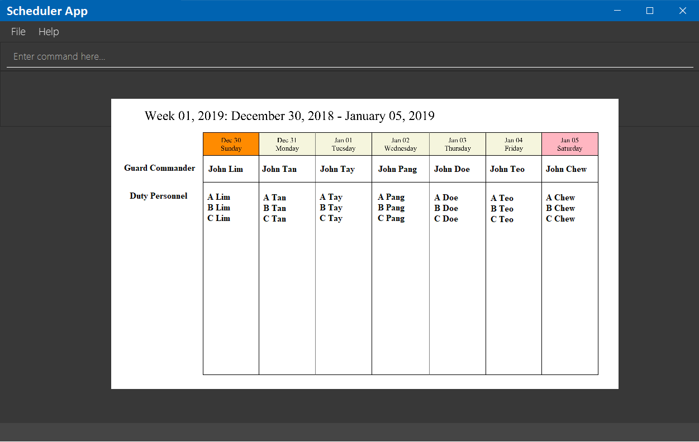

= Duty Planner
ifdef::env-github,env-browser[:relfileprefix: docs/]

https://travis-ci.org/CS2103-AY1819S2-W15-4/main[image:https://travis-ci.org/CS2103-AY1819S2-W15-4/main.svg?branch=master[Build Status]]
https://ci.appveyor.com/project/cs2103ez/main[image:https://ci.appveyor.com/api/projects/status/i0xblq9iwnmrgdai?svg=true[Build status]]
https://coveralls.io/github/CS2103-AY1819S2-W15-4/main?branch=master[image:https://coveralls.io/repos/github/CS2103-AY1819S2-W15-4/main/badge.svg?branch=master[Coverage Status]]
https://www.codacy.com/app/cs2103ez/main?utm_source=github.com&utm_medium=referral&utm_content=CS2103-AY1819S2-W15-4/main&utm_campaign=Badge_Grade[image:https://api.codacy.com/project/badge/Grade/fc0b7775cf7f4fdeaf08776f3d8e364a[Codacy Badge]]

ifdef::env-github[]

endif::[]

ifndef::env-github[]
image::images/Ui.png[width="600"]
endif::[]

* This is a desktop Duty Planner application. It has a GUI but most of the user interactions happen using a CLI (Command Line Interface). It is meant for army personnel to use to schedule and assign guard duties to personnel.
* Duty can be assigned for the upcoming months and soldiers can see their duties assigned to them as well as perform various different actions.
* This will save a lot of time for commanders planning duties as this will automatically allocate duties and make the process completely automated.

== Site Map

* <<UserGuide#, User Guide>>
* <<DeveloperGuide#, Developer Guide>>
* <<AboutUs#, About Us>>
* <<ContactUs#, Contact Us>>
=======

== Acknowledgements

* Some parts of this application were inspired by the excellent http://code.makery.ch/library/javafx-8-tutorial/[Java FX tutorial] by
_Marco Jakob_.
* Libraries used: https://github.com/TestFX/TestFX[TextFX], https://github.com/FasterXML/jackson[Jackson], https://github.com/google/guava[Guava], https://github.com/junit-team/junit5[JUnit5]
* Adapted from the https://github.com/se-edu/addressbook-level4[addressbook-level4] project created by the https://github.com/se-edu[se-edu initiative]

== Licence : link:LICENSE[MIT]

